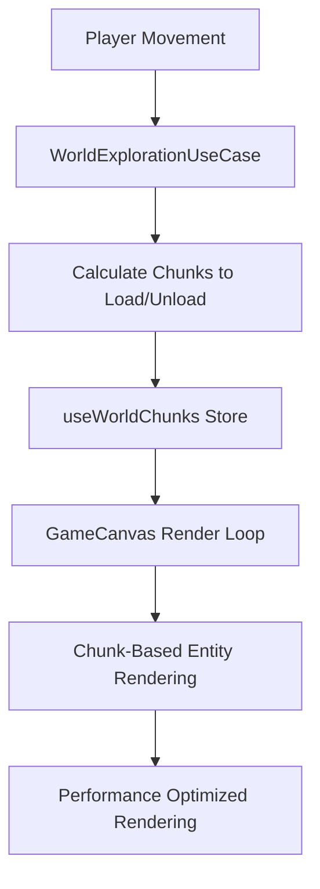

# Chunks System Documentation

## Overview

The Shapes RPG: Figureium game implements a chunks-based world system for efficient rendering and memory management. This document outlines the current implementation status, architecture, and future development plans.

## Current Implementation Status

### ✅ **Implemented Components**

#### 1. **Chunk Architecture (Designed)**
- **Location:** `client/src/application/useCases/WorldExplorationUseCase.ts`
- **ChunkCoordinates Interface:**
  ```typescript
  export interface ChunkCoordinates {
    readonly x: number;
    readonly y: number;
  }
  ```
- **Chunk Size:** 400x400 units (assumed in calculations)
- **Chunk Calculation Methods:**
  - `calculateChunksToLoad()` - Determines which chunks to load based on player position
  - `calculateChunksToUnload()` - Determines which chunks to unload when player moves away

#### 2. **World Area System (Active)**
- **Location:** `client/src/domain/valueObjects/WorldArea.ts`
- **Single Source of Truth:** `client/src/domain/services/ZoneConfigurationService.ts`
- **Current Areas:**
  - **Hub Area:** `-200 to 200` (x), `-150 to 150` (y)
  - **Peaceful Fields:** `200 to 600` (x), `-150 to 150` (y)
  - **Shards Area:** `600 to 1100` (x), `-450 to 450` (y)
- **Features:**
  - Area bounds validation
  - Visual themes per area
  - Enemy spawning rules per area
  - Game phase definitions (hub, combat, exploration)
  - Centralized zone configuration management

#### 3. **World Domain Service (Active)**
- **Location:** `client/src/domain/services/WorldDomainService.ts`
- **Functions:**
  - `findAreaForPosition()` - Determines which area contains a position
  - `calculateDistance()` - Distance calculations between positions
  - `getAccessibleAreas()` - Area connectivity logic

#### 4. **World Repository (Active)**
- **Location:** `client/src/infrastructure/persistence/InMemoryWorldRepository.ts`
- **Features:**
  - In-memory storage of world areas
  - Area initialization with default zones
  - Position-based area lookup

### ❌ **Missing Components (TBD)**

#### 1. **Chunk Store Management**
- **Missing:** `useWorldChunks` Zustand store
- **Purpose:** Manage active chunks, loading states, and chunk data
- **Location:** `client/src/lib/stores/useWorldChunks.tsx` (to be created)

#### 2. **Chunk-Based Rendering**
- **Current Issue:** GameCanvas renders all entities regardless of distance
- **Missing:** Chunk-based entity filtering
- **Missing:** Chunk loading/unloading in render loop
- **Location:** `client/src/components/GameCanvas.tsx` (needs modification)

#### 3. **Chunk Data Management**
- **Missing:** Chunk data structures for entities, NPCs, and world objects
- **Missing:** Chunk serialization/deserialization
- **Missing:** Chunk persistence system

#### 4. **Performance Optimization**
- **Missing:** Chunk-based culling system
- **Missing:** LOD (Level of Detail) system for distant chunks
- **Missing:** Chunk preloading system

## Architecture Design

### **Chunk System Flow**



### **Chunk Coordinate System**

- **Chunk Size:** 400x400 units
- **Coordinate Origin:** World origin (0,0)
- **Chunk Calculation:**
  ```typescript
  const chunkX = Math.floor(worldX / 400);
  const chunkY = Math.floor(worldY / 400);
  ```

### **Chunk Loading Strategy**

1. **Load Radius:** Configurable (default: 2 chunks around player)
2. **Unload Distance:** Chunks beyond load radius + buffer
3. **Preloading:** Adjacent chunks loaded in background
4. **Memory Management:** Automatic cleanup of distant chunks

## Implementation Plan

### **Phase 1: Core Chunk Store**
- [ ] Create `useWorldChunks` Zustand store
- [ ] Implement chunk loading/unloading logic
- [ ] Add chunk state management (loading, loaded, unloading)

### **Phase 2: Chunk-Based Rendering**
- [ ] Modify GameCanvas to use chunk system
- [ ] Implement chunk-based entity filtering
- [ ] Add chunk boundary visualization (debug mode)

### **Phase 3: Performance Optimization**
- [ ] Implement chunk culling system
- [ ] Add LOD system for distant chunks
- [ ] Optimize memory usage with chunk cleanup

### **Phase 4: Advanced Features**
- [ ] Chunk preloading system
- [ ] Chunk persistence and serialization
- [ ] Dynamic chunk generation for procedural content

## Technical Specifications

### **Chunk Data Structure**
```typescript
interface ChunkData {
  coordinates: ChunkCoordinates;
  entities: Entity[];
  npcs: NPC[];
  worldObjects: WorldObject[];
  loaded: boolean;
  lastAccessed: number;
}
```

### **Chunk Store Interface**
```typescript
interface WorldChunksStore {
  activeChunks: Map<string, ChunkData>;
  loadChunk: (coordinates: ChunkCoordinates) => Promise<void>;
  unloadChunk: (coordinates: ChunkCoordinates) => void;
  getChunkAt: (worldX: number, worldY: number) => ChunkData | null;
  getEntitiesInRadius: (centerX: number, centerY: number, radius: number) => Entity[];
}
```

### **Performance Targets**
- **Chunk Load Time:** < 16ms (60fps target)
- **Memory Usage:** < 100MB for active chunks
- **Render Performance:** 60fps with 9 active chunks (3x3 grid)

## Integration Points

### **Existing Systems**
- **WorldExplorationUseCase:** Already contains chunk calculation logic
- **WorldArea System:** Will work alongside chunk system
- **GameCanvas:** Needs modification to use chunk-based rendering
- **Entity System:** Will be filtered by chunk boundaries

### **Clean Architecture Compliance**
- **Domain Layer:** Chunk coordinates and business logic
- **Application Layer:** Chunk loading/unloading use cases
- **Infrastructure Layer:** Chunk data persistence
- **Presentation Layer:** Chunk store and rendering integration

## Future Considerations

### **Scalability**
- **Infinite World:** Support for procedurally generated chunks
- **Multiplayer:** Chunk synchronization between clients
- **Streaming:** Dynamic chunk loading from server

### **Advanced Features**
- **Chunk Variants:** Different chunk types (dungeon, overworld, etc.)
- **Chunk Events:** Area-specific triggers and interactions
- **Chunk Scripting:** Dynamic chunk behavior system

## References

- **Related Documentation:** [GameDesign.md](./GameDesign.md)
- **Architecture:** [Architecture.md](./Architecture.md)
- **Implementation:** `client/src/application/useCases/WorldExplorationUseCase.ts`

---

**Last Updated:** December 2024  
**Status:** Design Complete, Implementation Pending  
**Priority:** Medium (Performance Optimization)
